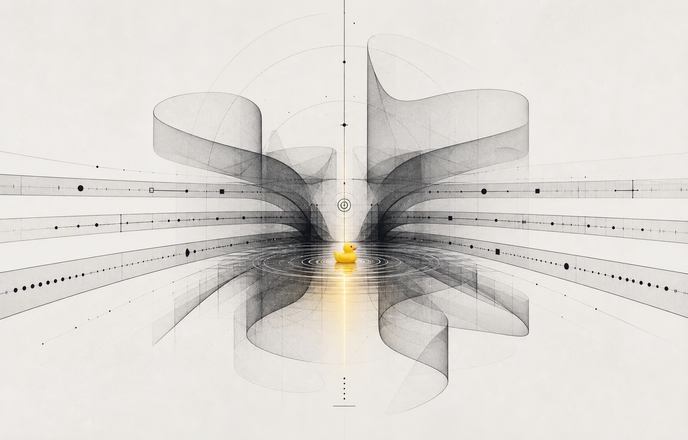

# TimeFold AI Art Direction

## Selected Reference

Primary visual reference:

This is the selected visual direction for TimeFold AI.

## Direction Name

**Dreamlike Time Coordinates**

## Core Feeling

TimeFold AI should feel like a precise scheduling instrument that has a small emotional memory inside it.

The interface is mostly monochrome, technical, and calm. The yellow duck/time buoy introduces one unexpected warm signal: the moment where scattered local timelines finally meet.

## What To Preserve

### 1. Pale Sci-Fi Workspace

Use gray-white backgrounds, subtle grain, and soft shadows. The app should feel spacious and breathable, not dark or heavy.

### 2. Black Time Geometry

Use black translucent lines, wireframes, ribbons, coordinate marks, and folded surfaces to represent time-space structure.

These should appear as:

- hero visual geometry
- subtle panel backgrounds
- TimeFold Ribbon accents
- loading states
- decorative motion behind recommendations

### 3. Yellow Time Buoy

The yellow duck-like marker represents the selected recommended time.

It should feel like:

- a tiny buoy in time
- a childhood bath-time memory
- a warm signal inside a technical system
- the selected UTC anchor made visible

Use it sparingly.

### 4. Water Ripple Motif

The ripple around the duck is useful because it suggests:

- the selected time has an effect across timelines
- one UTC moment propagates into many local realities
- the recommendation is a meeting point, not just a number

This can inspire small UI motions.

## What To Avoid

- Do not make the product childish.
- Do not make the duck large or mascot-dominant.
- Do not use bright yellow everywhere.
- Do not add bath, bathroom, toy, or bathtub imagery.
- Do not use spaceships, planets, portals, or fantasy sci-fi objects.
- Do not over-animate the page.
- Do not use dense world maps as the main visual.

## UI Translation

### Header / Hero

Use a cropped or recreated version of the selected visual as the atmospheric header image. Keep the actual tool visible immediately.

### Recommendation Cards

The selected recommendation should use:

- yellow accent marker
- thin black border
- small ripple or pulse animation
- clear score and tradeoff text

### TimeFold Ribbon

The selected UTC anchor should appear as:

- a vertical black line
- a small yellow marker at the intersection
- optional subtle ripple across timelines

### Loading State

When generating recommendations:

- show thin black timelines converging
- show the yellow marker gently floating
- avoid playful text

### Copy Success

After copying a schedule:

- use a small yellow pulse or ripple
- keep feedback concise

## Motion Principles

Use subtle, slow motion:

- gentle bobbing of the yellow marker
- soft ripple expansion
- slow line drift
- sweep animation when changing selected recommendation

Do not use:

- bouncing mascot animation
- fast spinning
- confetti
- loud transitions

## Implementation Notes

The generated image is a reference, not necessarily the final production asset.

For the MVP, we can:

1. Use the selected reference as an atmospheric visual.
2. Recreate simplified geometry in CSS/SVG/canvas for the live UI.
3. Use a small yellow marker component instead of relying on a detailed duck image in every view.

